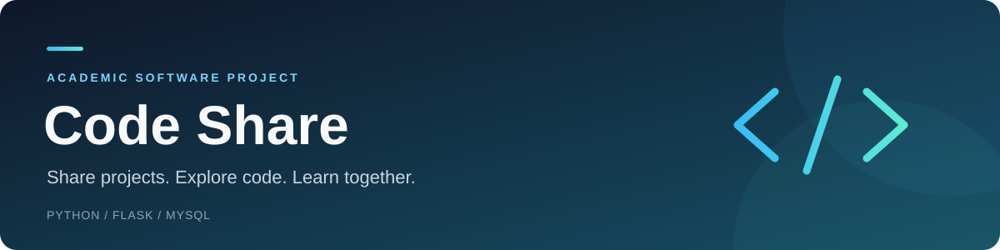
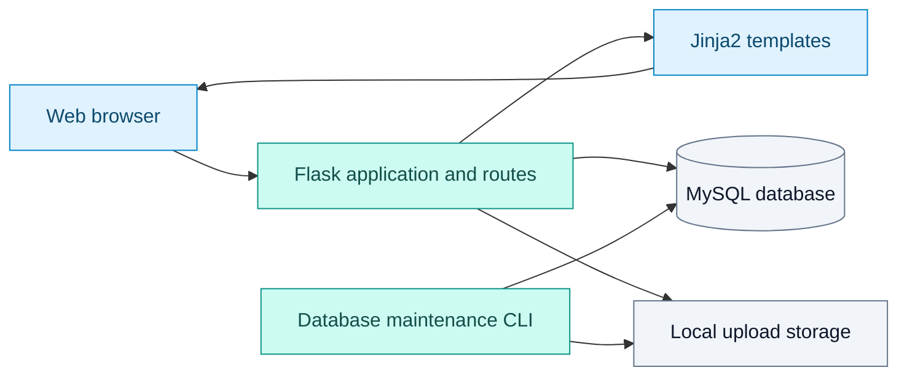

<p align="center">
  
</p>

<p align="center">
  <strong>An academic web application for sharing source-code projects and managing collaboration.</strong>
</p>

<p align="center">
  
  
  
  
</p>

<p align="center">
  <a href="#features">Features</a> &nbsp;·&nbsp;
  <a href="#getting-started">Getting started</a> &nbsp;·&nbsp;
  <a href="#suggested-demonstration">Demo guide</a> &nbsp;·&nbsp;
  <a href="#documentation">Documentation</a>
</p>

---

Code Share allows users to publish projects, control their visibility, share files,
and interact through comments, stars, and follows. Built with Flask and MySQL,
it demonstrates how authentication, relational data, access control, and file
storage work together in a complete web application.

> [!NOTE]
> Built for learning, academic demonstration, and further development.
> Uploaded source code can be viewed and downloaded; it is never executed by the application.

<details>
<summary><strong>Explore the README</strong></summary>

- [Academic objectives](#academic-objectives)
- [Features](#features)
- [Technology stack](#technology-stack)
- [Architecture](#architecture)
- [Getting started](#getting-started)
- [Suggested demonstration](#suggested-demonstration)
- [Testing](#testing)
- [Security and data integrity](#security-and-data-integrity)
- [Limitations and future work](#limitations-and-future-work)
- [Documentation](#documentation)

</details>

## Academic objectives

This project provides practical experience in:

- Developing a server-rendered web application with Python, HTML, CSS, and JavaScript.
- Modelling users, projects, memberships, and social interactions in a relational database.
- Implementing authentication and role-based authorization.
- Validating uploaded content and safely displaying user-generated text.
- Using transactions to keep related database changes consistent.
- Maintaining reproducible database migrations, regression tests, and recovery tools.

## Features

| Area | Implemented capabilities |
| --- | --- |
| Accounts | Registration, login, logout, and profile updates, including password and profile-photo changes. |
| Projects | Public or private visibility, project metadata, languages, tags, and active or archived status. |
| Collaboration | Owner, administrator, and member roles, membership management, and ownership transfer. |
| Files | Uploads and downloads, highlighted text/code previews, and ZIP folder browsing without extraction. |
| Project documentation | Automatic, sanitized Markdown README previews when a README is available. |
| Community | Comments, project stars, user follows, search, and activity views. |
| Maintenance | Versioned migrations, verified database/upload backups, restoration, and orphan-file review. |

Private-project permissions also apply to file previews and downloads.

## Technology stack

| Component | Technology |
| --- | --- |
| Backend | Python and Flask |
| Database | MySQL 8 with InnoDB; MySQL Connector/Python |
| Frontend | Jinja2 templates, HTML, CSS, and vanilla JavaScript |
| Forms and request protection | Flask-WTF and Flask-Limiter |
| File previews | Pygments, Markdown, and Bleach |
| Image processing | Pillow |
| Configuration | Environment variables loaded with python-dotenv |
| Tests and automation | Python unittest and GitHub Actions |

Dependency versions are pinned in [requirements.txt](requirements.txt).
The CI configuration tests Python 3.11 and 3.12.

## Architecture

The application uses Flask's application-factory pattern and separates route
handlers, database access, shared utilities, and presentation templates.
Structured application data is stored in MySQL; uploaded files are stored on disk.



```text
code_share/
|-- app.py                  # Application factory and application-wide handlers
|-- config.py               # Environment-based configuration
|-- db.py                   # Database access and transaction helpers
|-- utils.py                # Shared authentication, permissions, and file helpers
|-- manage_db.py            # Migration, backup, restore, and storage commands
|-- routes/                 # Authentication, dashboard, profile, project, and preview routes
|-- templates/              # Server-rendered HTML templates
|-- static/                 # Stylesheets, JavaScript, and application images
|-- migrations/             # Versioned database schema and baseline metadata
|-- tests/                  # Regression and database recovery tests
|-- docs/                   # Database operations and publication notes
|-- .github/workflows/      # Continuous integration configuration
|-- .env.example            # Configuration template without private credentials
`-- requirements.txt        # Pinned Python dependencies
```

The main database entities are users, projects, project memberships, files,
comments, stars, followers, tags, and activity records. Association tables link
projects to members, tags, and languages. Foreign keys and unique constraints
support data integrity. See [the initial migration](migrations/0001_initial.sql)
for the full schema.

## Getting started

### Prerequisites

- Git.
- Python 3.11 or 3.12; Python 3.12 is used in the commands below.
- A running MySQL 8 server.
- The `mysql` and `mysqldump` command-line clients for database maintenance.
- An existing MySQL account with the permissions needed to create the database
  and apply its schema. The setup command does not create a MySQL user.

The following instructions use **Windows PowerShell**, including the PowerShell
terminal in VS Code. Run each command from the repository root unless stated otherwise.

### 1. Clone the repository and install dependencies

```powershell
git clone https://github.com/Nano963-p/code_share.git
cd code_share
py -3.12 -m venv .venv
.\.venv\Scripts\python.exe -m pip install -r requirements.txt
```

If the Windows Python launcher (`py`) is unavailable, use `python -m venv .venv`
after confirming that `python --version` points to a supported Windows installation.
Virtual-environment activation is optional because these commands use its Python directly.

### 2. Configure the application

For a fresh installation, copy the configuration template:

```powershell
Copy-Item .env.example .env
.\.venv\Scripts\python.exe -c "import secrets; print(secrets.token_urlsafe(48))"
```

Do not overwrite an existing `.env`. Open `.env`, paste the generated value into
`SECRET_KEY`, and fill in your own database credentials.

| Variable | Purpose |
| --- | --- |
| `SECRET_KEY` | Private session-signing secret, at least 32 characters long. |
| `DB_HOST` / `DB_PORT` | MySQL server address and port; normally `127.0.0.1` and `3306`. |
| `DB_USER` / `DB_PASSWORD` | Credentials for your existing MySQL account. |
| `DB_NAME` | Application database name; use `code_share` for the commands below. |
| `SESSION_COOKIE_SECURE` | Keep `false` for local HTTP; use `true` with HTTPS. |
| `LOGIN_RATE_LIMIT` | Defaults to `5 per minute;30 per hour` per client IP. |
| `RATELIMIT_STORAGE_URI` | Defaults to `memory://` for local, single-process use. |
| `MYSQL_BIN_DIR` | Optional directory containing MySQL clients if automatic discovery fails. |

The application requires a valid secret and a nonempty database password.
Keep `.env` private; it is excluded from version control.

### 3. Initialize a new database

```powershell
.\.venv\Scripts\python.exe manage_db.py init --database code_share
```

This creates a new database and applies the versioned schema. It refuses to
replace an existing database. If you already have application data, follow the
[backup and migration guide](docs/database.md) instead. The old `schema.sql`
reset entry point is disabled.

### 4. Start the application

```powershell
.\.venv\Scripts\python.exe -m flask --app app:create_app run --host 127.0.0.1 --port 5000
```

Open [Code Share locally](http://127.0.0.1:5000) and create an account through the
registration page. There are no supplied demo-account credentials. Press `Ctrl+C`
to stop the server. If port 5000 is occupied, use `--port 5001` and open that port.

This command runs Flask's development server for local use.

### Linux, macOS, or WSL

In a separate checkout for your Linux/macOS environment, use the equivalent commands:

```bash
python3 -m venv .venv
.venv/bin/python -m pip install -r requirements.txt
cp .env.example .env
.venv/bin/python -c "import secrets; print(secrets.token_urlsafe(48))"
# Edit .env with the generated secret and your MySQL credentials before continuing.
.venv/bin/python manage_db.py init --database code_share
.venv/bin/python -m flask --app app:create_app run --host 127.0.0.1 --port 5000
```

Use a native virtual environment for each operating system. Do not recreate or
reuse a Windows `.venv` with WSL's Python. MySQL must be reachable from the
environment in which you run the application.

## Suggested demonstration

A short academic demonstration can follow this sequence:

1. Register two accounts and update a profile.
2. Create a public project with a description, languages, and tags.
3. Upload a code file or ZIP containing source code and a Markdown README.
4. Browse the uploaded files and show the highlighted code and README previews.
5. Use the second account to comment, star the project, and follow its author.
6. Create a private project and demonstrate access before and after adding a member.
7. Show the automated tests and explain how database transactions protect updates.

Use sample content that you have permission to share. Local uploads and account
data are not included in this repository.

## Testing

Run the regression suite from PowerShell:

```powershell
.\.venv\Scripts\python.exe -m unittest discover -s tests -v
```

By default, the suite uses temporary files, mocks, and an in-memory SQLite adapter;
it does not modify your application database. Tests cover form protection,
private-file access, preview sanitization and limits, profile images, transaction
failures, and database maintenance behavior.

The live MySQL recovery test is opt-in. It requires MySQL clients and an account
that can create and drop disposable test databases:

```powershell
$env:RUN_MYSQL_ADMIN_TESTS = '1'
.\.venv\Scripts\python.exe -m unittest discover -s tests -p test_database_admin.py -v
Remove-Item Env:RUN_MYSQL_ADMIN_TESTS
```

This test creates temporary databases to exercise migrations, backups, restoration,
and failure recovery, then cleans up its test databases.

[GitHub Actions](.github/workflows/tests.yml) is configured to run the regression
suite on Python 3.11 and 3.12 and a separate recovery job against MySQL 8 on pushes
and pull requests. Check the repository's Actions tab for the latest run result.

## Security and data integrity

The implementation includes password hashing, CSRF protection for POST forms,
login rate limits, session-cookie controls, and role checks for private resources.
File handling validates storage paths, sanitizes Markdown previews, and re-encodes
profile photos to static PNG images. Project uploads are served as attachments.

Database transactions group related mutations and activity records. File cleanup
is coordinated with commit and rollback outcomes to reduce the risk of losing
referenced uploads. Because MySQL and disk storage cannot share one atomic
transaction here, interrupted operations can still leave orphaned files.

To inspect unreferenced uploads without changing them:

```powershell
.\.venv\Scripts\python.exe manage_db.py orphans
```

The [database operations guide](docs/database.md) explains backups, restoration,
and reversible quarantine. Stop all writers before operations that require
maintenance mode; `--maintenance-confirmed` acknowledges this step but does not
stop the application for you. Backups contain private data and must stay outside
version control.

## Limitations and future work

- **Project sharing:** uploads are file snapshots. Git version history, merging,
  and code execution are outside the current scope.
- **Preview support:** previews are bounded to 1 MiB of UTF-8 text and 5,000 ZIP
  entries, with compression-ratio checks. Other archive formats are downloadable
  but do not have ZIP-style browsing. README previews omit remote images and scripts.
- **Local storage:** uploads need explicit backup and reconciliation. Scheduled
  backups and automatic cleanup retries are not implemented.
- **Runtime configuration:** the default rate-limit store is process-local and
  resets on restart. Multiple workers require shared storage; reverse-proxy
  handling and HTTPS settings require environment-specific configuration.
- **Evaluation:** automated regression tests support reliability, but do not
  establish production readiness or constitute an independent security audit.

Possible future academic work includes accessibility and usability evaluation,
browser-based end-to-end tests, performance measurements, and file versioning.
These are proposed extensions, not current capabilities.

## Documentation

- [Database migrations, backups, restoration, and storage recovery](docs/database.md)
- [Public repository cleanup notes](docs/publication.md)
- [Database schema](migrations/0001_initial.sql)
- [Automated test workflow](.github/workflows/tests.yml)

## License

No license file is currently included. Public visibility alone does not grant
permission to reuse or redistribute the code. A license should be selected by
the project owner before offering the project for general reuse.
